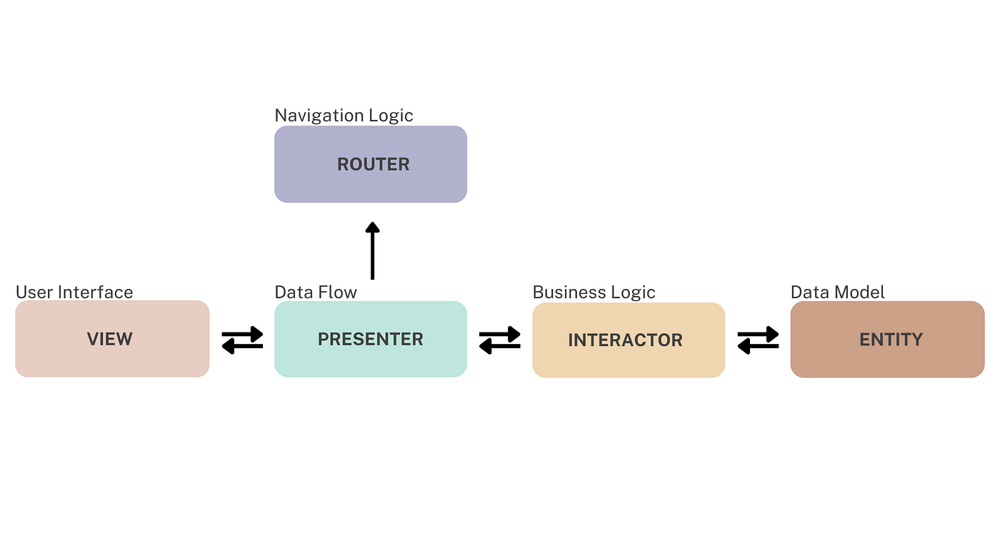

# VIPER Template
A custom Xcode template to streamline the creation of VIPER modules, following Clean Architecture principles. This template provides predefined files for each VIPER component: **View**, **Interactor**, **Presenter**, **Entity**, and **Router**.

## - Install for VIPER

### 1. Download the Template
Clone or download this repository

### 2. cd into repository an run:
```shell
make
```
### 3. Completed:
➡️ Please restart Xcode.

➡️ Please Add extensions to the project if needed

➡️ In Xcode, select 'New File...' or 'New File form Template...' to use VIPER templates.

## - VIPER Module Structure



Each generated module includes the following components:

- **View**: Handles UI and user interactions, delegating actions to the Presenter.
- **Interactor**: Contains the business logic and interacts with the data layer.
- **Presenter**: Coordinates between the View and Interactor, processes data, and updates the UI.
- **Entity**: Defines the data model for the module.
- **Router**: Manages navigation to other modules.
